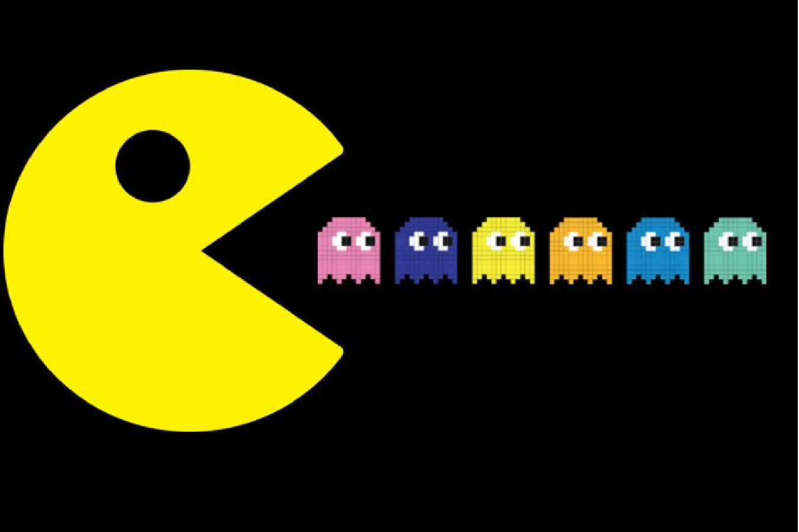

# PacMan Exercise
## For this exercise the goal was to create a PacMan Factory that will generate a limitless number of PacMan randomly moving about the screen at different speeds.
# How to Run
## To run through this exercise please fork the files to you local machine. Once you have the HTML, PNG, JS, and CSS files in VS you can drag the HTML file to your browser window and use the buttons in the upper left hand corner of your machine to begin the game.  One button generates PacMan over and over, the other button begins the movement.
# Future Improvements
## Some improvements I would like to make to this exercise would be to improvment the movements of PacMan.  I would like each PacMan to eventually be opening and closing their mouths every second or two as it does in the original game.  I also think it would be pretty cool if I can get the PacMan to eat each other if they colide with another from behind.
# License
## Please refer to the "MIT License.txt" file in repo for licensing information.

